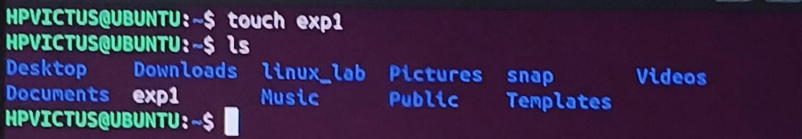

# linux_lab
# Experiment 2

We will be walking thourgh basic linux terminal commands

---

## "ls"
## Usage
  displays the contents of the directory

## Bash Script snippets

## "mkdir"
## Usage
  create new directory

## Bash Script snippets
    

## "touch"
## Usage
  to create new file

## Bash Script snippets
 

## "rm"
## Usage
  to remove the contents in the file

## Bash Script snippets
 

## "mv"
## Usage
  to move the directory

## Bash Script snippets
 

## "cp"
## Usage
  to copy directory

## Bash Script snippets
 

