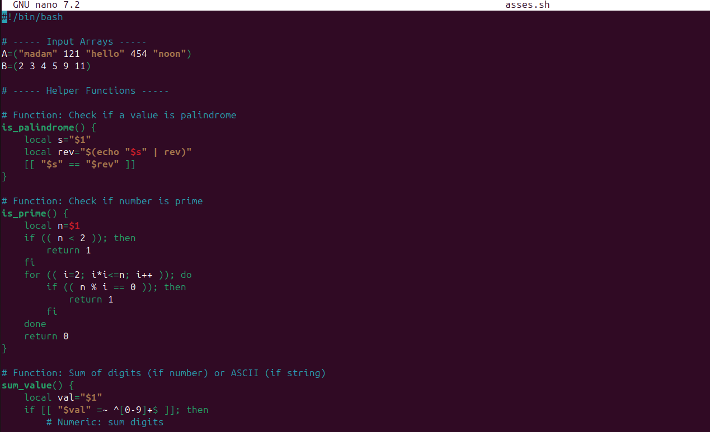
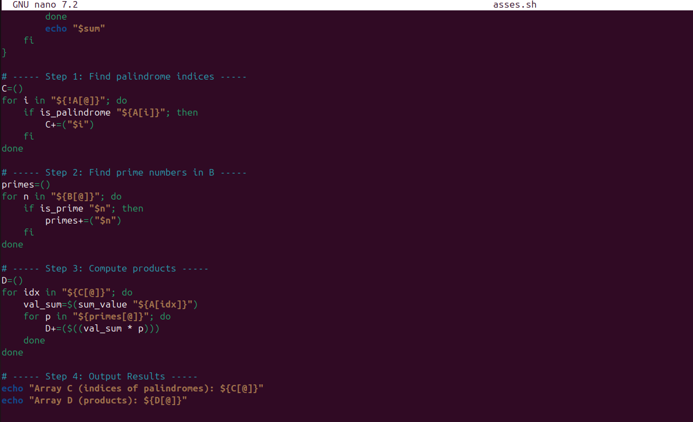

# Problem Description 


You are given two arrays:

Array A: Contains a list of numbers or strings.

Array B: Contains a list of integers.

Your program must:

Step 1: Identify the positions (indices) of all palindromic elements in Array A.
A palindrome is a string or number that reads the same backward as forward (e.g., 121, madam, 454).

Step 2: Identify all prime numbers in Array B.
A prime number is a number greater than 1 that has no divisors other than 1 and itself.

Step 3: For each palindrome found in Array A, calculate the sum of its digits (if numeric) or ASCII values (if string).
Then multiply this sum with each prime number found in Array B.

Step 4: Output two new arrays:

Array C: Contains the positions (indices) of palindromes in Array A.

Array D: Contains the product of each palindrome’s digit sum with every prime number in Array B.


```
#!/bin/bash

# ----- Input Arrays -----
A=("madam" 121 "hello" 454 "noon")
B=(2 3 4 5 9 11)

# ----- Helper Functions -----

# Function: Check if a value is palindrome
is_palindrome() {                                
    local s="$1"
    local rev="$(echo "$s" | rev)"
    [[ "$s" == "$rev" ]]
}

# Function: Check if number is prime
is_prime() {
    local n=$1
    if (( n < 2 )); then
        return 1
    fi
    for (( i=2; i*i<=n; i++ )); do
        if (( n % i == 0 )); then
            return 1
        fi
    done
    return 0
}

# Function: Sum of digits (if number) or ASCII (if string)
sum_value() {
    local val="$1"
    if [[ "$val" =~ ^[0-9]+$ ]]; then
        # Numeric: sum digits
        local sum=0
        for (( i=0; i<${#val}; i++ )); do
            sum=$((sum + ${val:i:1}))
        done
        echo "$sum"
    else
        # String: sum ASCII codes
        local sum=0
        for (( i=0; i<${#val}; i++ )); do
            sum=$((sum + $(printf "%d" "'${val:i:1}'")))
        done
        echo "$sum"
    fi
}

# ----- Step 1: Find palindrome indices -----
C=()
for i in "${!A[@]}"; do
    if is_palindrome "${A[i]}"; then
        C+=("$i")
    fi
done

# ----- Step 2: Find prime numbers in B -----
primes=()
for n in "${B[@]}"; do
    if is_prime "$n"; then
        primes+=("$n")
    fi
done

# ----- Step 3: Compute products -----
D=()
for idx in "${C[@]}"; do
    val_sum=$(sum_value "${A[idx]}")
    for p in "${primes[@]}"; do
        D+=($((val_sum * p)))
    done
done

# ----- Step 4: Output Results -----
echo "Array C (indices of palindromes): ${C[@]}"
echo "Array D (products): ${D[@]}"
```


4

# output

```
Array C (indices of palindromes): 0 1 3 4
Array D (products): 1024 1536 2560 5632 8 12 20 44 26 39 65 143 876 1314 2190 4818
```