# 📌 We will be walking thourgh basic linux terminal commands


# ✅ 1. Navigation Commands

## `pwd`– Print Working Directory
   Shows the current location in the filesystem.
   ```
   pwd
   ```
   ### 📌 Output example:
    /home/HPVICTUS/Deskstop/vg/linux_lab

   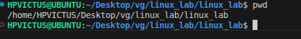📌


## `ls` – List Directory Contents
  The ls command is used to list files and directories in the current working directory. flag-a list down all the file and folder including the one which are hidden
  ```
  
    ls -l → Detailed list (permissions, size, date)
    ls -a → Shows hidden files (those starting with .)
    ls -la → Combined
```

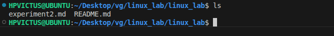

## `cd` – Change Directory
   Moves into a directory.
  
   ```
   cd
   ```
   ### Examples:

   
      cd Documents        # Go to Documents
      cd ..               # Go up one level
      cd /                # Go to root
      cd ~                # Go to home directory

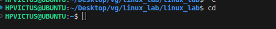

# ✅ 2. File and Directory Management

## `mkdir` – Make Directory
 Creates a new folder.
```
mkdir new_folder
```

## `touch`– Create File
Creates an empty file.
```
touch file.txt
```

## `cp`– Copy Files or Directories
```
cp source.txt destination.txt
```
## `mv` – Move or Rename Files
```
mv oldname.txt newname.txt
```

## `rm` – Remove Files
```
rm file.txt          # Delete file
rm -r folder_name    # Delete folder (recursively)
```
## ⚠️ Be careful! There is no undo.

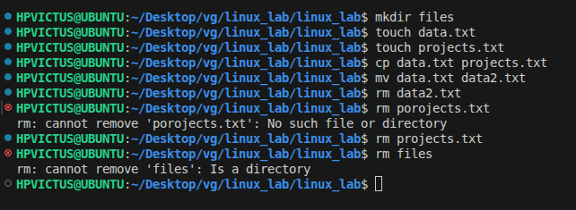

# ✅ 3. File Viewing & Editing

## `cat`– View File Contents
   Displays content in terminal.
```
cat file.txt
```
## `nano` – Edit Files in Terminal
A basic terminal-based text editor.
```
nano file.txt
```
    Use arrows to move
    CTRL + O to save
    CTRL + X to exit


## `clear` – Clears the Terminal
```
clear
```
Shortcut: CTRL + L

## ✅ 4. **System Commands**

### `echo` – Print Text

Useful for debugging or scripting.

```bash
echo "Hello, World!"
```

---

### `whoami` – Show Current User

```bash
whoami
```
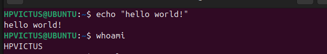
---

### `man` – Manual for Any Command

```bash
man ls
```

Use `q` to quit the manual.

---

## ✅ 5. **Searching and Finding**

### `find` – Locate Files

```bash
find . -name "*.txt"
```

🔍 Finds all `.txt` files in current folder and subfolders.

---

### `grep` – Search Inside Files

```bash
grep "hello" file.txt
```
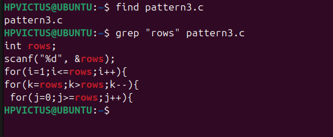

🔍 Searches for the word `hello` inside `file.txt`.

---

## ✅ 6. **Helpful Shortcuts**

| Shortcut   | Action                      |
| ---------- | --------------------------- |
| `Tab`      | Auto-complete files/folders |
| `↑ / ↓`    | Browse command history      |
| `CTRL + C` | Stop a running command      |
| `CTRL + L` | Clear screen                |

---

## ✅ 7. **Bonus: Chaining Commands**

* **Run multiple commands**:

```bash
mkdir test && cd test && touch hello.txt
```

* **Run only if previous command succeeds**: `&&`
* **Run regardless of success**: `;`

---

 # 🐚 Shell Tutorial – File Permissions with `chmod` and `chown`
---


## 🔹 1. Understanding File Permissions in Linux

Each file/directory in Linux has:

* **Owner** → The user who created the file.
* **Group** → A group of users who may share access.
* **Others** → Everyone else.

### Permission Types

* **r** → Read (4 in numeric)
* **w** → Write (2 in numeric)
* **x** → Execute (1 in numeric)

### Permission Layout

Example from `ls -l`:

```
-rwxr-xr--
```
Breakdown:

* `-` → Regular file (`d` = directory, `l` = symlink, etc.)
* `rwx` → Owner has read, write, execute
* `r-x` → Group has read, execute
* `r--` → Others have read only

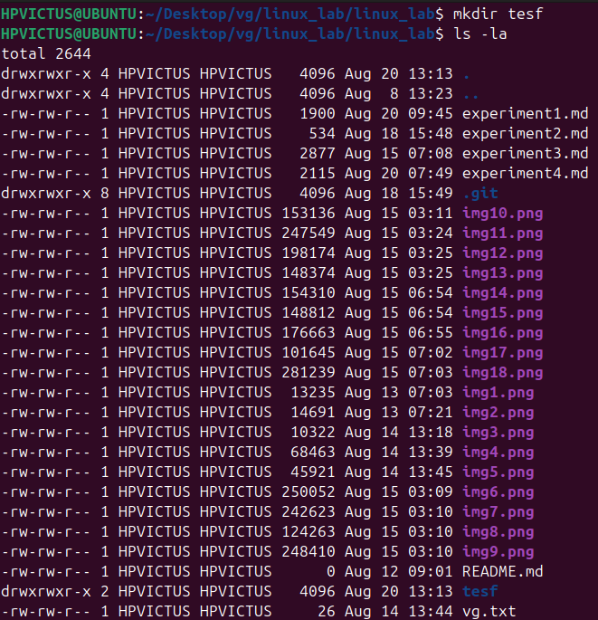
---
## 🔹 2. `chmod` – Change File Permissions

### Syntax

```bash
chmod [options] mode filename
```

Modes can be set in **numeric (octal)** or **symbolic** form.

---

### (A) Numeric (Octal) Method

Each permission is represented as a number:

* Read = 4
* Write = 2
* Execute = 1

Add them up:

* `7 = rwx`
* `6 = rw-`
* `5 = r-x`
* `4 = r--`
* `0 = ---`

#### Example:

```bash
chmod 777 script.sh
```

Meaning:

* Owner: 7 → `rwx`
* Group: 7 → `r-w-x`
* Others: 7 → `r-w-x`

### **image**
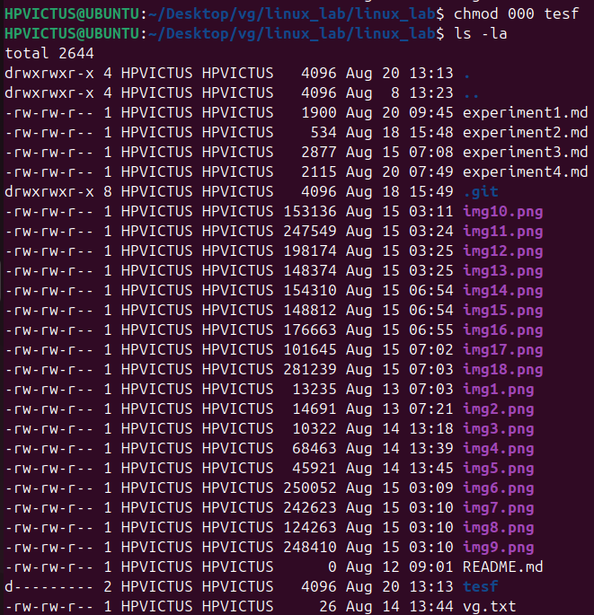

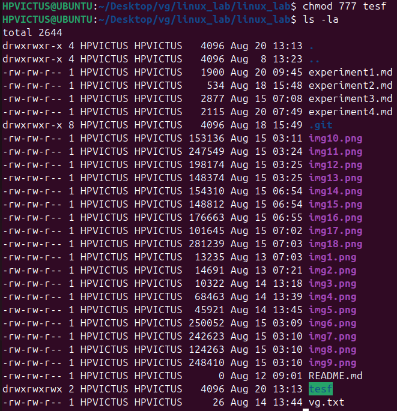

### (B) Symbolic Method

Use `u` (user/owner), `g` (group), `o` (others), `a` (all).
Operators:

* `+` → Add permission
* `-` → Remove permission
* `=` → Assign exact permission


Modes can be set in **numeric (octal)** or **symbolic** form.

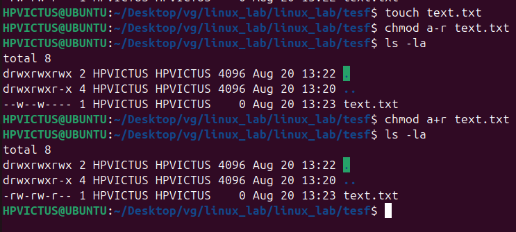

---
### (C) Recursive Changes

```bash
chmod -R 755 /mydir
```

* `-R` → applies changes recursively to all files/subdirectories.


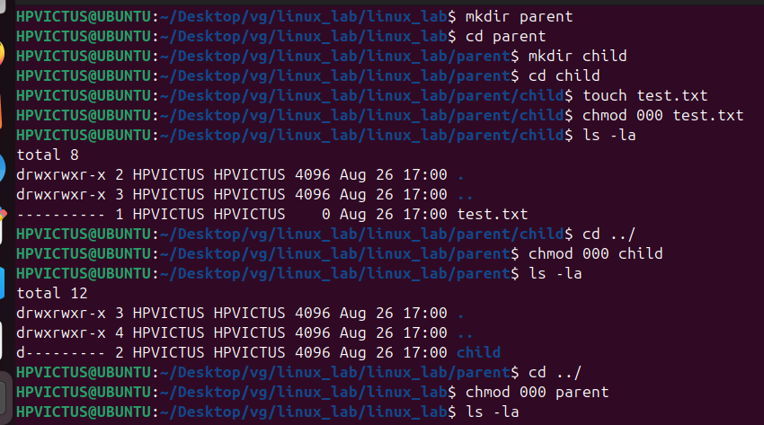

!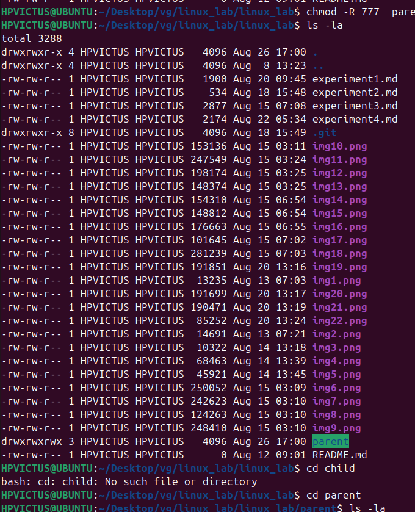

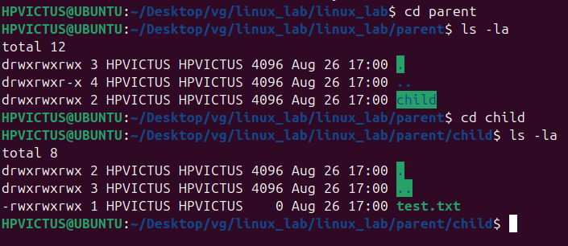
---

## 🔹 3. `chown` – Change File Ownership

### Syntax

```bash
chown [options] new_owner:new_group filename
```

### Examples:

```bash
chown vanshgoel.txt          # Change owner to user 'sameer'
chown vansh:dev.txt       # Change owner to 'sameer' and group to 'dev'
chown vansh:dev file.txt            # Change only group to 'dev'
chown -R vansh :dev /project    # Recursive ownership change
```
# **Practice Experiment on `chown`**

### 🔹 1. Create a new user

```bash
sudo useradd -m newuser
```

* `-m` → creates a home directory `/home/newuser`.

---

### 🔹 2. Create a new group

```bash
sudo groupadd newgroup
```

---

### 🔹 3. Add the user to the group

```bash
sudo usermod -aG newgroup newuser
```

* `-aG` → append user to the supplementary group (doesn’t remove existing groups).

---

### 🔹 4. Create a file (as current user, e.g. root or your login user)

```bash
touch testfile.txt
```

Check ownership:

```bash
ls -l testfile.txt
```

Example:

```
-rw-rw-r--1 sameerbhardwaj sameerbhardwaj 0 Aug 20 18:52 testfile.txt
```

---

### 🔹 5. Assign ownership of the file to `newuser` and `newgroup`

```bash
sudo chown newuser:newgroup testfile.txt
```

---

### 🔹 6. Verify ownership

```bash
ls -l testfile.txt
```

**Output:**

```
-rw-rw-r--1 newuser newgroup 0 Aug 20 18:52 testfile.txt
```
---

✅ **Key Tip**: Use **numeric for quick settings** (e.g., 755, 644) and **symbolic for fine adjustments** (`u+x`, `g-w`).

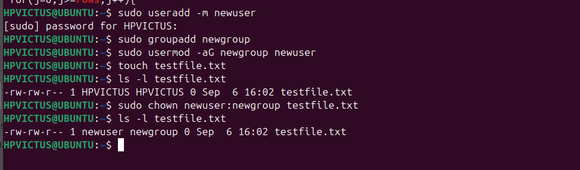

---

## 🔹 4. Putting It All Together

### Example Scenario

```bash
touch project.sh
ls -l project.sh
```

Output:

```
-rw-r--r-- 1 sameer dev 0 Aug 19 12:00 project.sh
```

Now:

```bash
chmod 700 project.sh       # Only owner has rwx
chmod u+x,g-w project.sh   # Add execute for user, remove write for group
chown root:admin project.sh # Change owner to root and group to admin
```

---

## 🔹 5. Quick Reference Table

| Numeric | Permission | Meaning      |
| ------- | ---------- | ------------ |
| 0       | ---        | No access    |
| 1       | --x        | Execute only |
| 2       | -w-        | Write only   |
| 3       | -wx        | Write + Exec |
| 4       | r--        | Read only    |
| 5       | r-x        | Read + Exec  |
| 6       | rw-        | Read + Write |
| 7       | rwx        | Full access  |

---
### 📌 Q1 what is the difference between chmod and chown?
    ans=chown-change ownership
         change the owner and group of a file or directory
        
        chmod-change permissions
         changes the permissions for the owner,group, and others
        
### 📌 Q2 how do you check current directory and user?

      ans= by using the pwd command.
