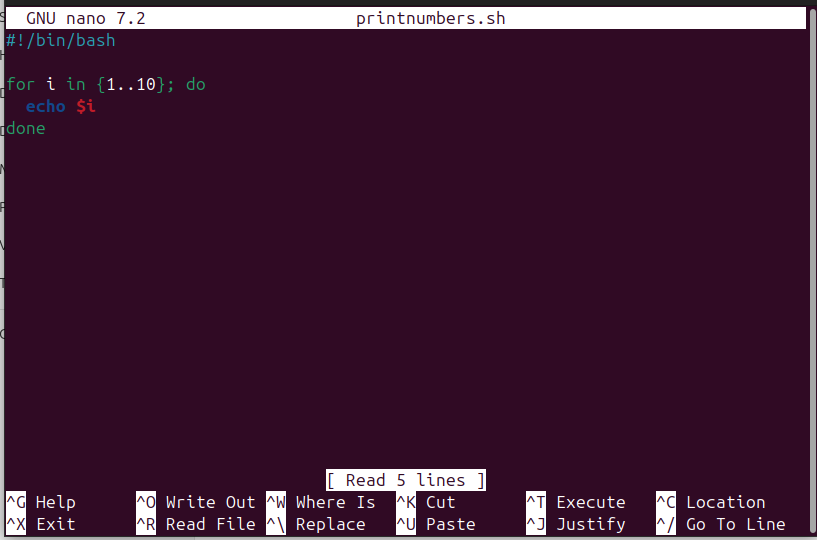

# modifying script
# ✅ Script: printnumers.sh

### Make it executable and example run:

## Modified Script (⁠ enhanced_numbers.sh ⁠)
 
 

1 Validate number of arguments

2  Validate that start, end, and step are integers

3 Determine direction based on start and end

### ⁠Purpose: 

.Print numbers with user-defined start, end, and step.

•  ⁠Input: User enters values at runtime.

•⁠  ⁠Validation:
•⁠  ⁠Step must be a positive integer.
•⁠  ⁠Inputs must be integers.
•⁠  ⁠Output: Prints sequence based on user choices.

### Example Runs

Example1

Example2

### Q1=differnce between $1,$@ and $# in bash?

    ans= $1= this refers to positional parameters
         $@= represents all arguments passed to the script
         $#= returns the number of arguments passed

### Q2=what does exit 1 mean in the script
    
     ans=script is terminating with an error