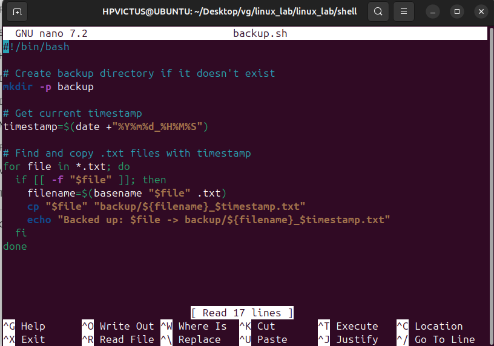
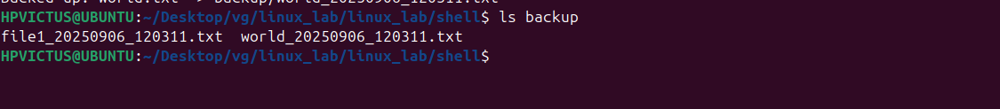

# 📌 BACKUP

# ✅1.⁠ ⁠backup.sh Script
Create a new file named backup.sh inside your project folder:

# ✅ 2. Make Script Executable
Run the following command once:

chmod 777 backup.sh

# ✅ 3. Testing the script
## 1. Create some samples .txt files:

## 2. Run the script:

./backup.sh

## 3. Check the backup/folder:

ls backup/

# 🔧 LAB4– File & Backup Automation

## Objective
Automate the backup of ⁠ .txt ⁠ files into a ⁠ backup/ ⁠ folder with timestamps in filenames.

---

## 🔧 Script Explanation

1.⁠ ⁠⁠ mkdir -p backup ⁠  
   Creates a folder n".

🔹 3. Using at (One-time Scheduling)
Run a script once at a specific time:

echo "/home/user/backup.sh" "
amed ⁠ backup ⁠ if it does not exist.

2.⁠ ⁠⁠ timestamp=$(date +"%Y%m%d_%H%M%S") ⁠  
   Generates a timestamp (format: YYYYMMDD_HHMMSS).

3.⁠ ⁠⁠ for file in *.txt; do ... done ⁠  
   Loops through all ⁠ .txt ⁠ files in the current directory.

4.⁠ ⁠⁠ basename "$file" .txt ⁠  
   Extracts the file name without extension.

5.⁠ ⁠⁠ cp "$file" "backup/${filename}_$timestamp.txt" ⁠  
   Copies the file into ⁠ backup/ ⁠ with the timestamp appended.

---

## 🔧 Example Run

### Input
Created two ⁠ .txt ⁠ files:

file1.txt
world.txt

### Command
./backup.sh

### Output
Files copied into ⁠ backup/ ⁠ with timestamps:

### 🛠️ Q1-What is the difference between cp,mv,and rsync?

     ans=cp-Copies files or directories
         mv-Moves or renames files or directories
         rsync-Synchronizes files/directories efficiently

### ✅ Q2-How can you schedule scripts to run automatically?
     
     ans=You can schedule scripts to run automatically using task schedulers built into your operating system.

