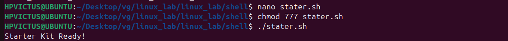
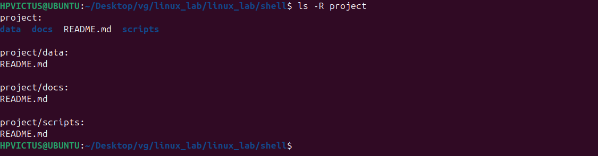

# 🔧 1. starter_kit.sh – Script to Set Up Project Structure


."#!/bin/bash → Shebang line. It tells the system to use bash to execute this script.

.Comments (# ...) → Explain what the script does (not executed)"

."mkdir = “make directory.”

.-p = creates parent directories only if they don’t exist, preventing errors.

.project/{scripts,docs,data} uses brace expansion to create:

project/scripts/

project/docs/

project/data/
(All inside 
the project/ folder).

."echo "text" prints text.

.>	⁠redirects the output into a file. If the file doesn’t exist, it creates it; if it exists, it overwrites it.

.Example:

  .echo "# Project Root" > project/README.md creates a file called README.md in the project/ folder with the heading “# Project Root”.


## 🔧 output


## 🔧 Check the folder structure:



# 🔧 LAB Extra – Starter Kit & Automation

## Purpose of the Script
The script ⁠ starter_kit.sh ⁠ is designed to automate the creation of a starter project environment.  
It ensures a consistent folder structure (⁠ scripts/ ⁠, ⁠ docs/ ⁠, ⁠ data/ ⁠) under the ⁠ project/ ⁠ directory and places placeholder ⁠ README.md ⁠ files inside each folder.  
This helps developers begin with an organized workspace without manually creating directories.

## Example Run

### Command:
```bash
bash starter_kit.sh"
```


### 🔧 Q1 Why is automation useful in DevoPs?

    ans=📌1.Consistency and reliability

        📌2.Speed and efficiency

        📌3.Scalability

        📌 4.Reduced Human Error 

### 🔧 Q2 what does mkdir -p do?

    ans=."mkdir = “make directory.”

         .-p = creates parent directories only if they don’t exist, preventing errors.


