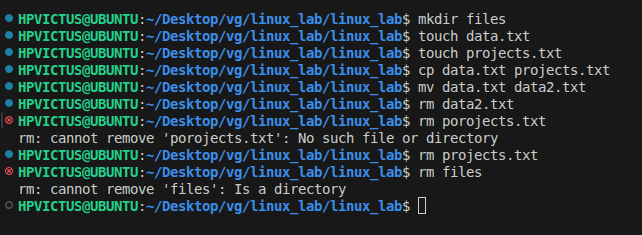

# experiment 2

to transfer data from one file to other

## `mkdir` – Make Directory
 Creates a new folder.
```
mkdir new_folder
```

## `touch`– Create File
Creates an empty file.
```
touch file.txt
```

## `cp`– Copy Files or Directories
```
cp source.txt destination.txt
```
## `mv` – Move or Rename Files
```
mv oldname.txt newname.txt
```

## `rm` – Remove Files
```
rm file.txt          # Delete file
rm -r folder_name    # Delete folder (recursively)
```
## ⚠️ Be careful! There is no undo.

