# 🏠 Case 1: Mac and Ubuntu on the same network
## ✅Step 1: Enable SSH on Ubuntu

On Ubuntu, install and enable SSH:
```
sudo apt update
sudo apt install openssh-server
sudo systemctl enable ssh
sudo systemctl start ssh
```

Check it’s running:

```
sudo systemctl status ssh
```

##  ✅ Step 2: Find Ubuntu’s local IP address

Run:

```
hostname -I
```
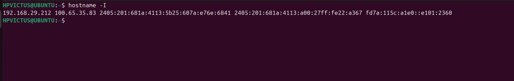
You’ll get something like 192.168.1.42.

## ✅ Step 3: Connect from Mac

On your Mac, open Terminal and run:

```
ssh username@192.168.1.42
```
Replace username with your Ubuntu username.

Enter your password when prompted — you’re in! ✅

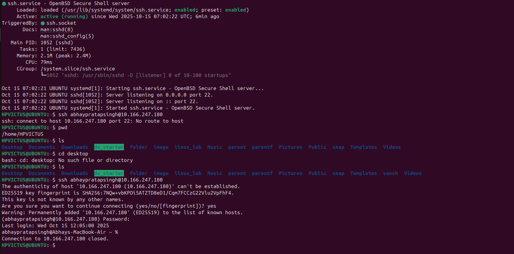

# ON MAC

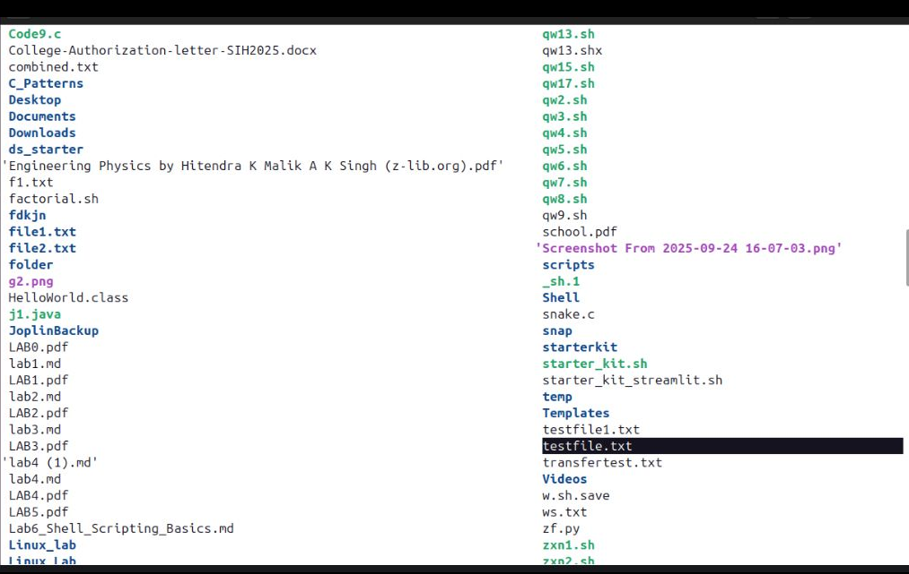

# 🌐 Case 2: Mac and Ubuntu on different networks (e.g., home ↔ office or remote server)

##  ✅🔹 Option 1: Connect to a remote Ubuntu server (e.g., cloud VM)

If your Ubuntu machine is a remote server (AWS, DigitalOcean, etc.), it already has SSH enabled.
You just need:
```
ssh username@<public-IP-address>
```
Make sure:

The server’s firewall allows port 22 (default SSH port).

Your cloud provider security group or firewall allows inbound SSH.

##  ✅🔹 Option 2: Connect to your Ubuntu home PC remotely

If your Ubuntu computer is behind a router:

1. Find your Ubuntu’s local IP:
hostname -I


2. Log in to your router and port-forward port 22 to that IP.

3. Find your public IP (visit https://whatismyipaddress.com
4. From your Mac, connect via:

```
ssh username@<your-public-IP>
```
or better yet, use a dynamic DNS (DDNS) service like No-IP or DuckDNS so you can use a hostname instead of changing IPs.

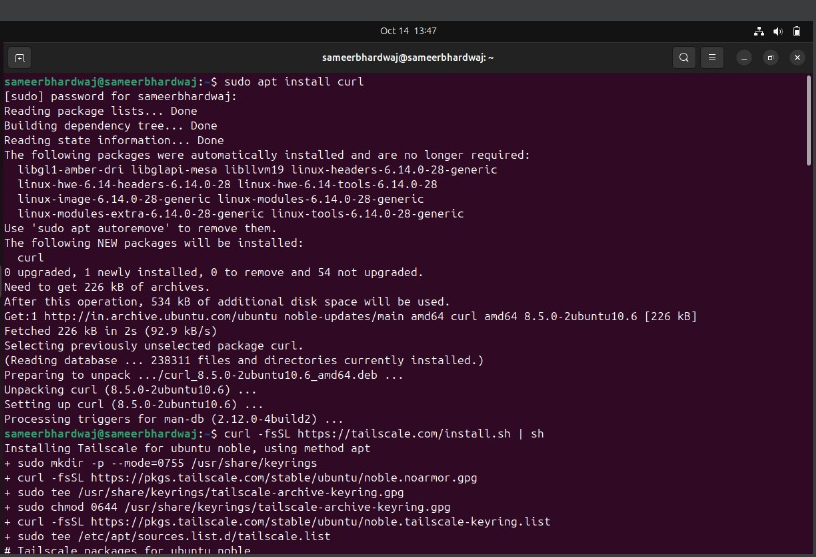

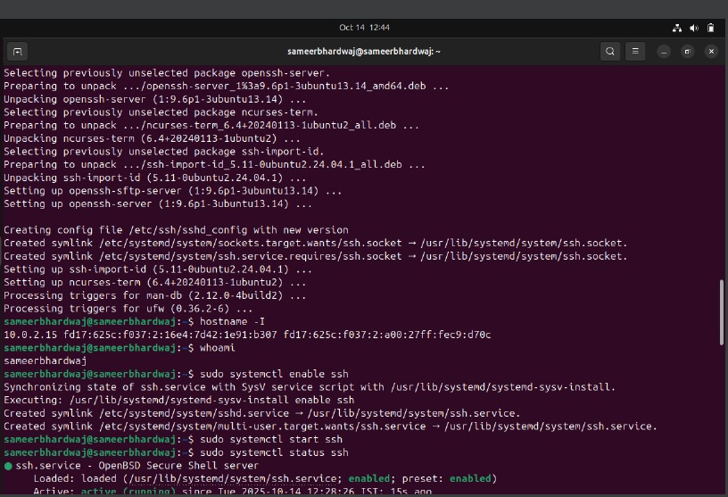

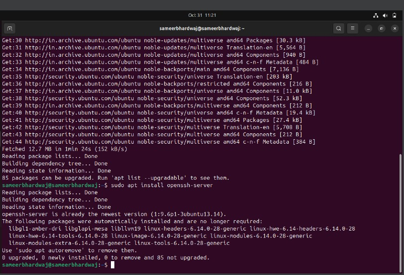

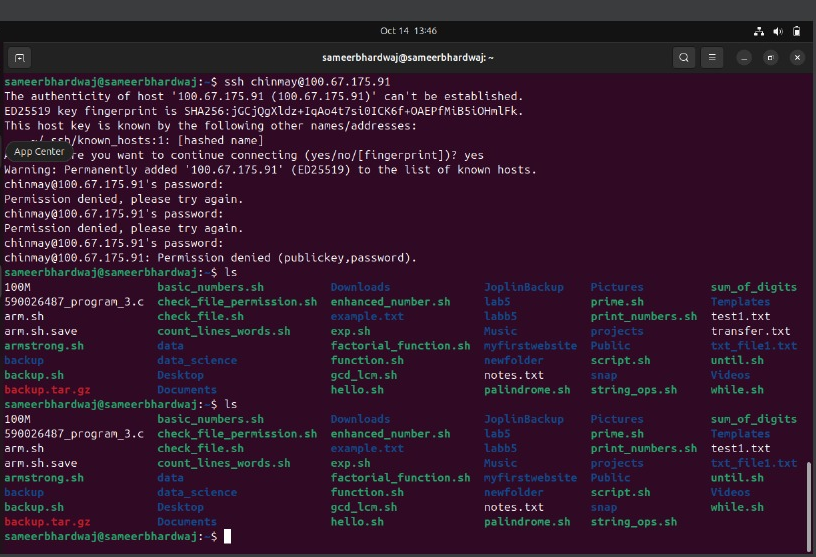

# 🏠 GUI

# ✅1) Prepare & secure the remote machine (run on friend’s laptop)

Run these on the friend’s laptop (they must have sudo):
```
# install SSH and optional VNC
sudo apt update
sudo apt install -y openssh-server tigervnc-standalone-server

# create non-root user if needed (won't fail if exists)
sudo useradd -m frienduser || true

# enable and start SSH
sudo systemctl enable --now ssh

# add your public key (replace <your-pubkey>) and set safe permissions
sudo -u frienduser mkdir -p /home/frienduser/.ssh
echo "<your-pubkey>" | sudo tee -a /home/frienduser/.ssh/authorized_keys
sudo chmod 700 /home/frienduser/.ssh
sudo chmod 600 /home/frienduser/.ssh/authorized_keys
sudo chown -R frienduser:frienduser /home/frienduser/.ssh


```

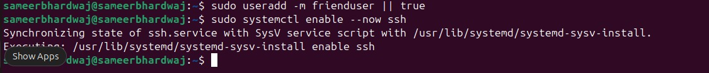

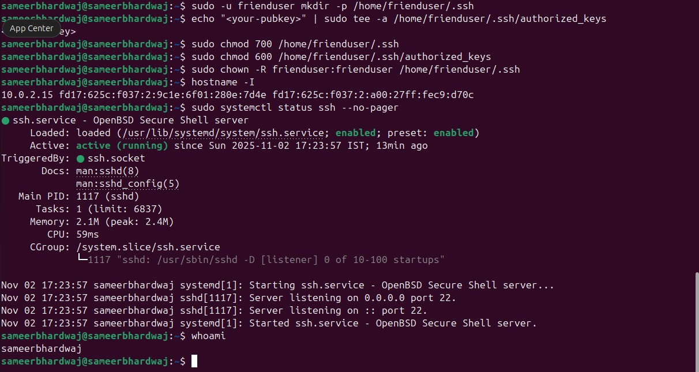
Verify sshd is running:
```
sudo systemctl status ssh --no-pager
# or
ss -tlnp | grep :22
```
# ✅2) Test X11 forwarding (single GUI app) — from your laptop

Preflight on your laptop:

Linux: usually ready.

macOS: install & run XQuartz and start it before SSH.

Windows: install an X server like VcXsrv or Xming and run it.

Then on your laptop run:

```
# connect with X11 forwarding (use -X or -Y if needed; -Y is more permissive)
ssh -p 22 -X frienduser@FRIEND_IP
# once connected, run a simple GUI test:
xeyes &    # or gedit & or xclock &
```
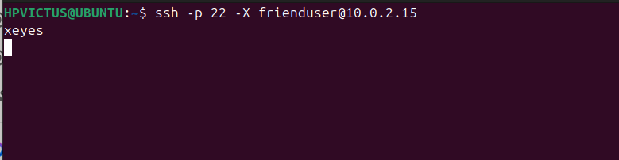
Success criteria: the GUI app window appears on your laptop and is responsive.

Troubleshooting quick checks:

If you see Warning: No xauth data; using fake or X apps fail: try -Y (trusted) instead of -X: ssh -Y -p 22 frienduser@FRIEND_IP.

Ensure DISPLAY is set on the SSH session (run echo $DISPLAY — should show something like localhost:10.0).

Ensure client X server (XQuartz/VcXsrv) is running and allowing connections.

Security note: X11 forwards every GUI app over SSH, but X11 is older and can let remote apps access local X resources — use only with trusted machines. For stronger isolation, prefer the VNC-over-SSH approach below.

# ✅ 3) Full desktop: VNC server on friend’s laptop + SSH tunnel from your laptop

On friend’s laptop (as frienduser):

```
# start a VNC server on display :1 (creates :1 -> TCP 5901)
vncserver :1
# optionally stop with: vncserver -kill :1
```
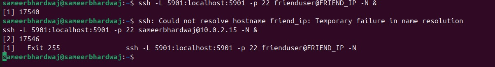
(Configure desktop environment in ~/.vnc/xstartup if needed — many distros auto-configure.)

On your laptop: create a local SSH tunnel (keeps VNC server bound to localhost on remote; only SSH port open externally)

```
# create an SSH tunnel mapping your localhost:5901 to friend's localhost:5901
ssh -L 5901:localhost:5901 -p 22 frienduser@FRIEND_IP -N &
# -N = no remote command; & runs in background (adjust as preferred)
```
Then open your VNC viewer and connect to:

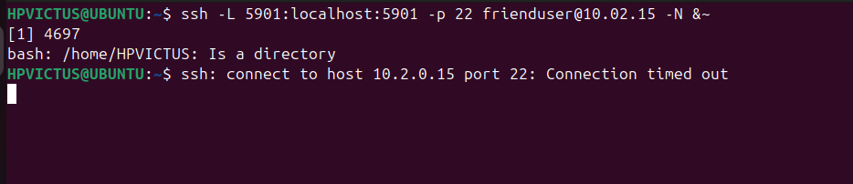

```
localhost:5901
```
