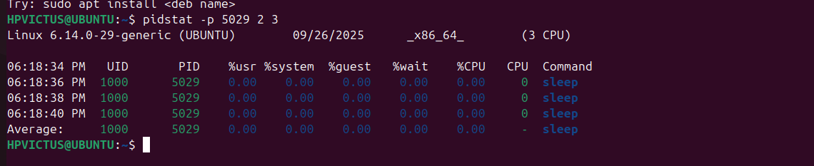

# **Linux Process Management Commands**

This document explains various Linux commands to manage and monitor processes.

---

## 🌲 **1. List Processes: `ps aux`**
- **a** → show processes for all users  
- **u** → show user/owner of process  
- **x** → show processes not attached to a terminal  

**Example Output:**
```
USER       PID  %CPU %MEM    VSZ   RSS TTY      STAT START   TIME COMMAND
root         1  0.0  0.1 167500  1100 ?        Ss   Sep25   0:05 /sbin/init
vibhu     1234  1.2  1.5 274532 15632 ?        Sl   10:15   0:12 /usr/bin/python3 script.py
mysql     2001  0.5  2.0 450000 20988 ?        Ssl  Sep25   1:02 /usr/sbin/mysqld
```


---

## 🌳 **2. Process Tree: `pstree -p`**
Shows parent-child process relationships.

**Example Output:**
```
systemd(1)─┬─NetworkManager(778)
           ├─sshd(895)─┬─sshd(1023)───bash(1024)───pstree(1101)
           ├─mysqld(2001)
           └─python3(1234)
```

---

## 📊 **3. Real-Time Monitoring: `top`**
Displays real-time CPU/memory usage.

**Example Output:**
```
top - 10:40:46 up  22 min,  1 user,  load average: 0.22, 0.38, 0.27
Tasks: 211 total,   1 running, 210 sleeping,   0 stopped,   0 zombie
%Cpu(s):  0.1 us,  0.3 sy,  0.0 ni, 99.5 id,  0.0 wa,  0.0 hi,  0.1 si,  0.0 st
MiB Mem :   5776.9 total,   2161.6 free,   1138.6 used,   2799.3 buff/cache
MiB Swap:      0.0 total,      0.0 free,      0.0 used.   4638.2 avail Mem 

   PID USER      PR  NI    VIRT    RES    SHR S  %CPU %MEM     TIME+ COMMAND
  1992 sameerb+  20   0 4967692 411396 141592 S   3.6  7.0   0:59.64 gnome-s+
 12065 sameerb+  20   0  553448  52396  42096 S   0.5  0.9   0:00.63 gnome-t+
  1394 root      20   0  316824   8788   7380 S   0.3  0.1   0:00.39 upowerd
  2568 sameerb+  20   0 2947568  67764  51612 S   0.3  1.1   0:01.47 gjs
 11299 root      20   0       0      0      0 I   0.3  0.0   0:01.92 kworker+
 12078 sameerb+  20   0   14500   5924   3748 R   0.3  0.1   0:00.06 top
     1 root      20   0  23212  14144   9664 S   0.0  0.2   0:09.05 systemd
     2 root      20   0       0      0      0 S   0.0  0.0   0:00.02 kthreadd
     3 root      20   0       0      0      0 I   0.0  0.0   0:00.00 pool_wo+
     4 root      20   0       0      0      0 I   0.0  0.0   0:00.00 kworker+
     5 root      0  -20       0      0      0 I   0.0  0.0   0:00.00 kworker+
     6 root      0  -20       0      0      0 I   0.0  0.0   0:00.00 kworker+
     7 root      0  -20       0      0      0 I   0.0  0.0   0:00.00 kworker+
     8 root      0  -20       0      0      0 I   0.0  0.0   0:00.00 kworker+
    10 root      0  -20       0      0      0 I   0.0  0.0   0:00.00 kworker+
    11 root      0  -20       0      0      0 I   0.0  0.0   0:00.00 kworker+
    13 root      0  -20       0      0      0 I   0.0  0.0   0:00.00 kworker+

```
👉 Press `q` to quit.


---

## ⚡ **4. Adjust Process Priority**
- Start process with low priority:
```
nice -n 10 sleep 300 &
[1] 3050
```
- Change priority of running process:
```
renice -n -5 -p 3050
3050 (process ID) old priority 10, new priority -5
```

---

## 🔧 **5. CPU Affinity: `taskset`**
- Show affinity:
```
taskset -cp 3050
pid 3050's current affinity list: 0-3
```
- Restrict to core 1 only:
```
taskset -cp 1 3050
pid 3050's current affinity list: 1
```

---

## 📂 **6. I/O Scheduling Priority: `ionice`**
```
ionice -c 3 -p 3050
successfully set pid 3050's IO scheduling class to idle
```
👉 Class 3 (idle) → Process only gets I/O when system is idle.

---

## 📑 **7. File Descriptors: `lsof`**

```
COMMAND PID USER FD TYPE DEVICE SIZE/OFF NODE NAME
sleep 15082 sameerbhardwaj cwd DIR 8,2 4096 3407874 /home/sameerbhardwaj
sleep 15082 sameerbhardwaj rtd DIR 8,2 4096 2 /
sleep 15082 sameerbhardwaj txt REG 8,2 35336 275947 /usr/bin/sleep
sleep 15082 sameerbhardwaj mem REG 8,2 5719296 278970 /usr/lib/locale/locale-archive
```

---

## 🐛 **8. Trace System Calls: `strace`**
```
strace -p 3050
strace: Process 3050 attached
restart_syscall(<... resuming interrupted nanosleep ...>) = 0
nanosleep({tv_sec=300, tv_nsec=0}, 0x7ffd4a60d8b0) = ? ERESTART_RESTARTBLOCK (Interrupted by signal)
```

---

## 📡 **9. Find Process Using a Port: `fuser`**
```
sudo fuser -n tcp 8080
8080/tcp:           4321
```

---

## 📊 **10. Per-Process Stats: `pidstat`**
```
pidstat -p 3050 2 3

Linux 5.15.0 (ubuntu)   09/25/25        x86_64        (4 CPU)
12:30:20      UID       PID    %usr %system  %CPU   CPU  Command
12:30:22      1000      3050    0.00    0.00   0.00     1  sleep
12:30:24      1000      3050    0.00    0.00   0.00     1  sleep
12:30:26      1000      3050    0.00    0.00   0.00     1  sleep
```

---

## 🔐 **11. Control Groups (cgroups)**
- Create new cgroup:
```
sudo cgcreate -g cpu,memory:/testgroup
```
- Limit CPU and Memory:
```
echo 50000 | sudo tee /sys/fs/cgroup/cpu/testgroup/cpu.cfs_quota_us
echo 100M   | sudo tee /sys/fs/cgroup/memory/testgroup/memory.limit_in_bytes
```
- Add a process (PID 3050) to cgroup:
```
echo 3050 | sudo tee /sys/fs/cgroup/cpu/testgroup/cgroup.procs
```
# 🎯 12. Alternatives to nice / renice
1. chrt (Real-Time Scheduling)
Set real-time scheduling policies (FIFO or Round Robin).

sudo chrt -f 50 sleep 1000
chrt -p <pid>


2. ionice (I/O Priority Control)
ionice -c 2 -n 7 tar -czf backup.tar.gz /home


3. taskset (CPU Affinity)
taskset -c 1 firefox


4. Control Groups (cgroups)
sudo cgcreate -g cpu,memory:/lowprio
echo 20000 | sudo tee /sys/fs/cgroup/cpu/lowprio/cpu.cfs_quota_us
echo 200M   | sudo tee /sys/fs/cgroup/memory/lowprio/memory.limit_in_bytes
echo 1234 | sudo tee /sys/fs/cgroup/cpu/lowprio/cgroup.procs

5. systemd-run
systemd-run --scope -p CPUWeight=200 stress --cpu 4

6. schedtool
sudo schedtool -R -p 10 <pid>

✅ Summary Table
Tool	Focus	Alternative to
chrt	Real-time scheduling policies	nice
ionice	I/O priority control	(complementary)
taskset	CPU affinity control	(complementary)
cgroups	Fine-grained resource management	nice (more powerful)
systemd-run	systemd + cgroups resource mgmt	nice
schedtool	Custom scheduling policies	nice

---