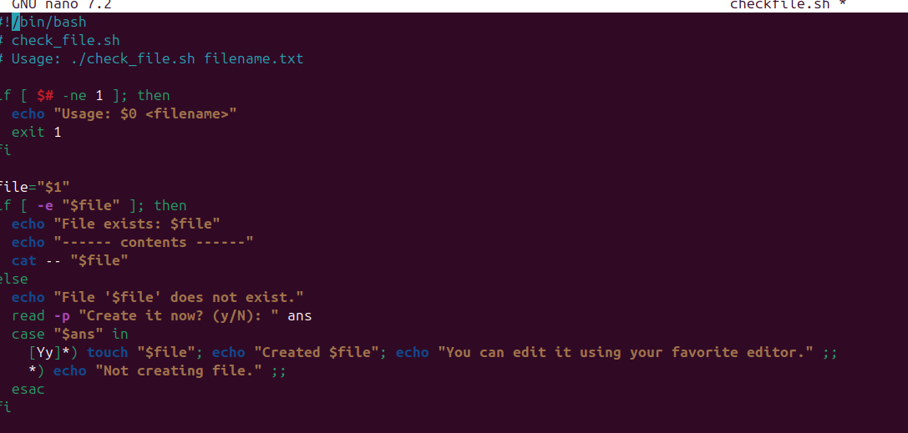
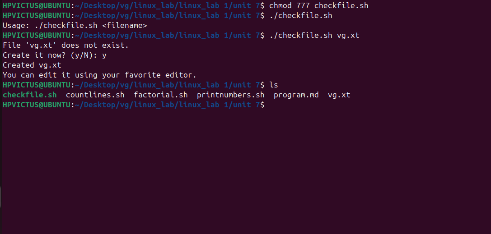

# program

  

  # 🔎 Line-by-Line Explanation

#!/bin/bash
→ Shebang line, tells the system to use bash to run this script.

2–3. Comments explaining the script name and usage.

4–7.

if [ $# -ne 1 ]; then
  echo "Usage: $0 <filename>"
  exit 1
fi

$# = number of command-line arguments.

If not equal to 1, print usage and exit.

$0 is the script name itself.

👉 Ensures the user must provide one filename.

file="$1"

$1 is the first argument passed (the filename).

Stores it in variable file.

10–14.

if [ -e "$file" ]; then
  echo "File exists: $file"
  echo "------ contents ------"
  cat -- "$file"

-e "$file" checks if the file exists.

If yes → print confirmation and display its contents using cat.

15–21 (else part):
If the file does not exist:

Inform the user: "File '$file' does not exist."

Ask: "Create it now? (y/N): "

Use a case statement:

If answer starts with y or Y → touch creates an empty file, then prints confirmation.

Otherwise → "Not creating file."

✅ What this script does

Takes a filename as input.

If file exists → shows its contents.

If file does not exist → asks user whether to create it.

👉 Example run:

$ ./check_file.sh notes.txt
File 'notes.txt' does not exist.
Create it now? (y/N): y
Created notes.txt
You can edit it using nano/vi/etc.

Would you like me to also rewrite the script with extra safety improvements (like handling directories, permissions, etc.) or just keep it simple like this?

